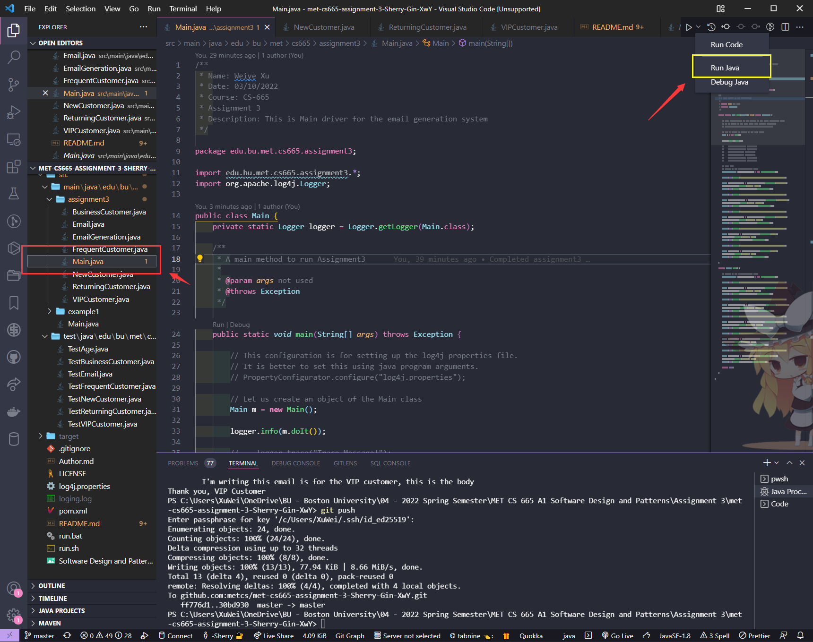

# Project Description

## GitHub Repo
```
git@github.com:metcs/met-cs665-assignment-3-Sherry-Gin-XwY.git
```
## 1. Application Description  
A company has different types of customers, like Business, Returning,  Frequent, New and VIP.  
The management of the company needs tp send customer specific emails to their customers. They  
would need to have an application that generates emails from a base template for different types of  
customers.

In this assignment, you will implement this "E-MailGeneration" Application for email auto-  
generation based on specific customer types.

## 2.1 Implementation Description
This is my design for the assignemnt 3 E-mail generation system. I would like to use the Factory Pattern which is very easy way to implement it.

Email is a class which provide some method to change their own data, and other different type of email which can use this email template to update their message.

the email generator will going to create a new email depends on which type of email it going to create, and update the email template.

* How flexible is your implementation, e.g., how you add or remove in future new email type?  
* Answer: I can just create a new class and defined which kind of email it is, edit the template, and add it to the EmailGeneration.java, Since it just use new class to update the Email template, which it is very simple to add or remove email type.
* 
* How is the simplicity and understandability of your implementation?
* Answer: Please see the attached UML diagram to see how does the System looks like. it is very simple to understand it.
* 
* How do you avoid duplicated code?
* Answer: Some duplicated code which need to setup different template of the email, but I think the main email template is very clear.
## 2.2 UML-Diagram


## 2.3 Implement your solution in Java

# How to compile the project

We use Apache Maven to compile and run this project. 

You need to install Apache Maven (https://maven.apache.org/)  on your system. 

Type on the command line: 

```bash
mvn clean compile
```

# How to create a binary runnable package 


```bash
mvn clean compile assembly:single
```


# How to run

```bash
mvn -q clean compile exec:java -Dexec.executable="edu.bu.met.cs665.assignment3.Main" -Dlog4j.configuration="file:log4j.properties"
```

# Run all the unit test classes.


```bash
mvn clean compile test checkstyle:check  spotbugs:check
```

# Using Spotbugs to find bugs in your project 

To see bug detail using the Findbugs GUI, use the following command "mvn findbugs:gui"

Or you can create a XML report by using  


```bash
mvn spotbugs:gui 
```

or 


```bash
mvn spotbugs:spotbugs
```


```bash
mvn spotbugs:check 
```

check goal runs analysis like spotbugs goal, and make the build failed if it found any bugs. 


For more info see 
https://spotbugs.readthedocs.io/en/latest/maven.html


SpotBugs https://spotbugs.github.io/ is the spiritual successor of FindBugs.

# If you're using vscode IDE, you can use the run button to run the code.
## 1. locate you file to the Main.java
## and hit the **run button** -> hit the **run java** button to run the code.



# Run Checkstyle 

CheckStyle code styling configuration files are in config/ directory. Maven checkstyle plugin is set to use google code style. 
You can change it to other styles like sun checkstyle. 

To analyze this example using CheckStyle run 

```bash
mvn checkstyle:check
```

This will generate a report in XML format


```bash
target/checkstyle-checker.xml
target/checkstyle-result.xml
```

and the following command will generate a report in HTML format that you can open it using a Web browser. 

```bash
mvn checkstyle:checkstyle
```

```bash
target/site/checkstyle.html
```


